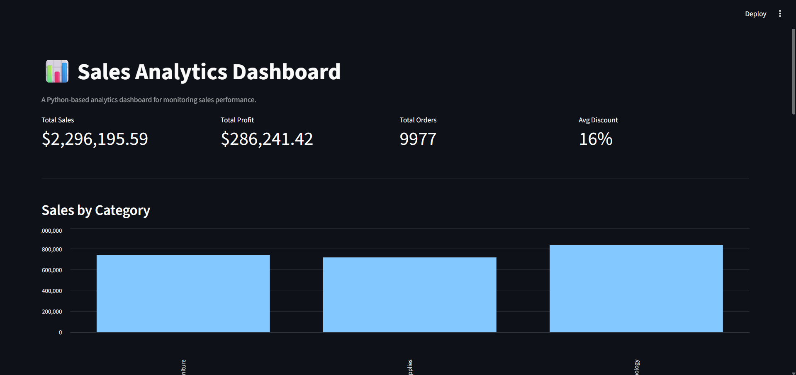

# 📊 Sales Analytics Dashboard

A Python-based analytics dashboard for monitoring sales performance.

---

## Overview
This project demonstrates how a data-driven dashboard can be built using Python,
Pandas, NumPy, and Streamlit. The focus is on clean backend design, modular code
structure, and clear visualization of sales performance metrics.

The project is designed from a software developer perspective and avoids machine
learning, emphasizing data processing, aggregation, and explainability.

---

## Features
- CSV-based data loading and validation
- Data cleaning and preprocessing using Pandas
- KPI computation using NumPy
- Modular backend design using OOP principles
- Interactive Streamlit dashboard
- Filters for region and product category
- Category, region, and sub-category performance analysis

---

## Dashboard Preview

---

## Tech Stack
- Python
- Pandas
- NumPy
- Streamlit

---

## Project Structure

